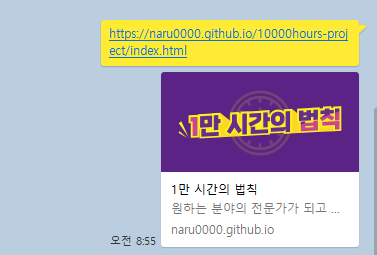

# 🕐 1만 시간의 법칙

> **"연습은 어제의 당신보다 당신을 더 낫게 만든다."**

어떤 분야의 전문가가 되기 위해 필요한 훈련 시간을 계산해주는 웹 애플리케이션입니다.

## 📖 프로젝트 소개

1만 시간의 법칙에 따라 원하는 직업의 전문가가 되기 위해 필요한 일수를 계산할 수 있습니다.

-   원하는 직업 입력
-   하루 훈련 시간 입력
-   1만 시간 달성까지 필요한 훈련 일수 확인

## 🛠 기술 스택

-   **HTML5** - 시맨틱 마크업
-   **CSS3** - 모바일 퍼스트 반응형 디자인
-   **BEM** - CSS 네이밍 컨벤션
-   **미디어쿼리** - 반응형 웹 구현

## 📱 반응형 구현

| 디바이스 | 브레이크포인트 | 특징                     |
| -------- | -------------- | ------------------------ |
| 모바일   | ~767px         | 세로 레이아웃, 작은 폰트 |
| 데스크톱 | 768px~         | 가로 레이아웃, 큰 폰트   |

-   모바일 레이아웃부터 디자인하여 큰 화면을 대응하는 방식으로 개발하는 모바일 퍼스트 방식이 효율적이라 판단하여 선택하게 되었습니다. 태블릿 중간 단계 없이 768px 하나의 브레이크포인트로 반응형을 구현했습니다.

## ✨ 주요 기능

-   ⏰ **시간 계산 기능** (현재 UI만 구현, JavaScript 구현 예정)
-   📱 **반응형 디자인**
-   🎯 **모달 팝업** (현재 UI만 구현, JavaScript로 구현 예정)
-   ♿ **웹 접근성** 고려
-   🔍 **SEO 최적화** 적용

## 📸 스크린샷

### 모바일


### 데스크톱


### sns 공유시 썸네일



## 🔗 배포 링크

🌐 **Live Demo**: [[1만 시간의 법칙](https://naru0000.github.io/10000hours-project/)]

## 📁 프로젝트 구조

```
1만시간의법칙/
├── index.html
├── css/
│   ├── reset.css
│   └── style.css
├── images/
│   ├── title.png
│   ├── clock.png
│   ├── quotes.png
│   ├── click.png
│   ├── logo.png
│   ├── licat.png
│   └── favicon.ico
└── README.md
```

## 🚧 개발 과정 주요 이슈

### 1. **웹 접근성을 고려한 폰트 설정**

rem을 편리하게 계산하고 웹접근성을 고려하여 `html { font-size: 62.5%; }` 의 상대값을 사용하여 1rem = 10px로 계산할 수 있게 하였습니다.

### 2. **반응형 텍스트 개행 처리**

버튼 텍스트가 모바일에서는 두 줄로, PC에서는 한 줄로 나와야 하는 요구사항이 있었습니다. `word-break` 속성으로 해결하려 했지만 실패했고, br태그에 클래스를 따로 주어 `<br class="question-btn__break">`와 미디어쿼리를 조합하여 반응형 개행을 구현했습니다.

### 3. **BEM 네이밍 컨벤션 적용**

`.header__title img` 같은 중첩 선택자를 쓰고 싶은 유혹과 싸우며 BEM 방식을 사용했습니다. 처음에는 각 요소마다 클래스를 주는 것이 번거로웠지만, 점점 사용하면서 제가 코드 구조를 보기에 편리해지는 장점을 스스로 느끼게 되었습니다.

## 💡 개발하며 배운 점

-   **프로젝트 초기 세팅**: 폴더 구조부터 git 초기 세팅과 클래스 방법론까지 익숙하지 않아 계속 고민해보고,적용하는 법을 배웠음
-   **HTML 유효성 검사**: W3C Validator에서 <section> 태그에 헤딩 요소가 없다는 warning이 발생하여 <div>로 변경. 시멘틱 태그를 무작정 사용하는 게 아니라 의미에 맞게 사용해야 함을 학습
-   **CSS 변수의 실용적 활용**: 색상은 변수로, 폰트 사이즈는 직접 rem 값 사용이 더 효율적

## 🎯 향후 개발 계획

-   [ ] JavaScript로 훈련 예상 시간이 나올 수 있게 하기
-   [ ] '훈련하기'버튼 클릭시 모달창 노출 구현
-   [ ] 입력값 유효성 검사 추가

---

**개발 기간**: 2025.06.18 - 2025.06.19  
**개발자**: [고우리]
